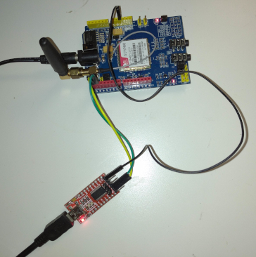

<p align="center"></p>  

# PDUlib
Encode/Decode PDU for sending/receiving SMS.
## Alphabets
Both the default GSM 7 bit and UCS-2 16 bit alphabets are supported which means that you can, in practice, send and receive in any language you want.  
This implementation partially processes the User Data Header (UDH). The practical implication of this is that concatenated messages are supported but media or national language extensions are not supported.
## Target audience
The code is written in plain C++ so it should be usable by both desktop and Arduino coders.  
Previous users of this library prior to version **0.5.5** are encouraged to read the version information [here](#055) and [here](#057) regarding additions to the API and simplification for the Arduino IDE user.
# Constructor
<b>PDU()</b>  
<b>PDU(unsigned int)</b>  
The optional parameter is the size, in bytes, of the buffer used to encode/decode PDU's. Default is 100 bytes. To calculate the size suitable for your circumstances, see the [Buffer Size](#calculating-the-buffer-size) section below.  
For the sake of minimizing RAM usage, the same buffer is used for both incoming and outgoing messages. Do not try to do both simultaneously.  
You will have to play with [getOverflow](#getoverflow) and different buffer sizes to find the optimal number for your application. If your code both sends and receives messages the buffer size must be the maximum of that needed for incoming/outgoing.
# API
## decodePDU
<b>bool decodePDU(const char *pdu)</b>  
If using a GSM modem, in PDU mode **not TEXT mode** an incoming message is displayed as.  
+CMT: nn    where nn is length  
XXXXXXXXX   where XXXXXX is a string of hexadecimal character. It is this line that should be decoded.  
After decoding the PDU its constituent parts can be recovered with the methods below.    
Returns **true** after a successful decode, else **false**. False may be for a number of reasons e.g. corrupted data or an unsupported format such as Multi-Media (MMS). **true** does not imply that then entire message was decoded. Call *getOverflow* to check if there was a buffer overflow. It will then still be possible to retrieve part of the message.  
~~<b>CAVEAT</b> pdu MUST be all uppercase. I have had reports that some modems show characters A to F in lowercase. Until I address this in code, the user must take the necessary action.~~  Issue #27, fixed in 0.5.7  
## getConcatInfo
<b>int *getConcatInfo()</b>  
To be called after calling **decodePDU**.  
Returns a pointer to an array of 3 integers that lists the concatenation data of the message. If indices 1 or 2 of the array are zero, it is a standalone message, not part of a concatenated message.  
index 0 - Reference number of the message, may be zero.  
index 1 - Part number (starts from 1).  
index 2 - Total number of parts in this message.  

Note that a multi-part message may not necessarily arrive in order of part numbers. It is your responsibility to keep track of
concatenation information in order to reconstruct the complete, original, message. 
## getSCAnumber
<b>const char *getSCAnumber()</b>  
Returns the number of the SCA from an incoming message, i.e. the Service Centre that delivered the message.  
## getSender
<b>const char *getSender()</b>  
Returns the phone number of the sender from an incoming message.  
## getTimeStamp
<b>const char *getTimeStamp()</b>    
Returns the timestamp of an incoming message in the format YYMMDDHHMMSS.  
## getText
<b>const char *getText()</b>  
Returns the body of an incoming message. Note that it is a UTF-8 string. In a Desktop environment it should be displayable, as is.  However in a resource restricted environment e.g. an OLED screen attached to an Arduino you will probably have to create a solution for non-ASCII characters.
## encodePDU
<b>int encodePDU(const char *recipient,const char *message)</b>  
<b>int encodePDU(const char *recipient,const char *message, unsigned short refNumber,unsigned char numParts,unsigned char partNumber)</b>  
### Parameters
1. recipient. The phone number of the recipient. It must conform to the following format, numeric only, no embedded white space. An international number must be preceded by '+'.
2. message. The body of the message, in UTF-8 format. This is typically what gets typed in from any keyboard driver. The code will scan the message to deduce if it is all GSM 7 bit, or not. If all GSM 7 bit then the maximum message length allowed is 160 characters, else 70 CSU-2 symbols.
3. refNumber. If specified this is part of a multi-part message. refNumber must be the same for all parts of the message. refNumber may not be zero.
4. numParts. If specified this is part of a multi-part message. This specifies how many messages make up the entire message. numParts must be the same for all parts of the message.  
5. partNumber. If specified this is part of a multi-part message. This specifies the index of this part in the whole message. The index starts from 1.  

### Return value.
This is the length of the PDU and is used in the GSM modem command +CGMS when sending an SMS. **Note** this is not the length of the entire message so can be confusing to one that has not read the documentation. To learm the structure of a PDU read [here](https://bluesecblog.wordpress.com/2016/11/16/sms-submit-tpdu-structure/).  
A return value of less than zero indicates a fatal error. The possible errors, enumerated as an *enum*: 
<table>
<tr><th>UCS2_TOO_LONG</th><th>A UCS-2 string is > 70 octets long, too long for a standalone message. Must be sent as a multipart message.</th></tr>
<tr><th>GSM7_TOO_LONG</th><th>A GSM7 string is > 160 characters long, too long for a standalone message. Must be sent as a multipart message.</th></tr>
<tr><th>MULTIPART_NUMBER</th><th>Multipart message parameters are inconsistent e.g. part number greater than total number of parts.</th></tr>
<tr><th>ADDRESS_FORMAT</th><th>An SCA or Recipient address is not numeric or too long.</th></tr>
<tr><th>WORK_BUFFER_TOO_SMALL</th><th>The workbuffer size is too small (see PDU constructor).</th></tr>
<tr><th>ALPHABET_8BIT_NOT_SUPPORTED</th><th>8 Bit alphabet not supported.</th></tr>
</table>

## setSCAnumber
<b>void setSCAnumber(const char *)</b>  
Before one can encode and send a PDU the number of the Service Centre must be known.  
Typically this can be discovered in a GSM modem by issuing the command  
AT+CSCA?  
## getSMS  
<b>const char *getSMS()</b>  
This returns the address of the buffer created by **encodePDU**. The buffer already contains the termination character CTRL/Z so can be used as is.  
## getOverflow
<b>bool getOverflow()</b>
### After Encode
Call *getOverflow* after *encodePDU*. If the result is *true* then there was not enough space in the buffer to create the message. This is fatal and the message cannot be sent.  
The method is really obsolete from version 0.5.7 as a return value of <b>WORK_BUFFER_TOO_SMALL</b> from [encodePDU](#encode) fulfills the same purpose.
### After Decode
Call *getOverflow* after *decodePDU*. If *true* there was not enough space in the buffer to fully decode the message. Calling *getText* will show that part which could be decoded.
# Development and Debugging
My development environment is VS Code/PlatformIO on Ubuntu. It is basically an Arduino environment which means that while I get
some goodies such as Intellisense these are no debugging facilities such as breakpoints and watch. As pdulib is pure C++ I had to adopt another strategy to debug the same pdulib sources, but in their desktop environment. This is described later.
## Arduino Development
### PlatformIO (Linux)
New sketches (projects) are created via PlatformIO which then creates a directory structure of source, include and library folders. Each sketch has its own libraries so to ensure that every sketch uses the same physical copy of pdulib sources. The **createSoftLinks.sh** script achieves this and must be run just once after cloning this workspace from Github. If you create a new sketch, edit **createSoftLinks.sh**, add the new sketch and run again. Note that PlatformIO, by default, creates a main file called **main.cpp**. If you create a new sketch, rename this file to \<sketchname\>.c++.  The **copysketches.sh** copies <sketchname>.c++ files to the correct place used by Arduino IDE and renames that file to <sketchname>.ino.  
For those sketches that need credentials i.e SCA phone number and Target phone number, there is 1 master copy of **credentials.h** in the DesktopExample/src folder. The script **copycredentials.sh** copies that file into the correct place for PlatformIO and Arduino IDE.   
The macro **PM**, if set, will place translation tables in flash memory.  
To add compiler switches, add the following line to the **platformio.ini** file, **env** section.
```
build_flags = -DPM
```

### PlatformIO (non-Linux)
Needs solutions to the **createSoftLinks.sh**, **copysketches.sh** and **copycredentials.sh** scripts. As I do not develop under Windows or IOS I have no intention of doing that work. Anyone else is invited to do that if needed.
### Arduino IDE
Arduino IDE uses a different directory structure and has different rules for file names. Firstly the source files must be in the project root folder and the main file must be named \<sketchname\>.ino. Also any files with the suffix cpp will get compiled, hence the reason for renaming **main.cpp** to \<sketchname.c++\>. Simply copy src/\<sketchname\>.c++ to the root folder and change the suffix to ino.  
The macro **PM**, if set, will place translation tables in flash memory.  
Edit the **pdu.h** file, uncomment the line to enable PM
```
//#define PM
```
## Desktop Development
As this is a PlatformIO oriented workspace you cannot directly compile and debug in the VS Code environment. First compile externally by invoking **make** from the command line in the pdulib directory. Note that the Makefile is configured to include the pdulib sources. Once compiled the app can be debugged in normal fashion **Run/Start Debugging** menu of VS Code. Don't panic if you get an error message that Debug cannot find a target. In the top left hand corner of the screen you will see a green arrow and a drop down list of debug target, select Debug(pdulib) and click the green arrow. You are now in a classic C++ debug environment, breakpoints and all.
# Desktop GSM Modem Setup
My GSM modem is an SIM900 Arduino breakout board connected to an FTDI USB-Serial device, thus it appears as an /dev/ttyUSB* device. On Windows it will be COMnn where nn is a number asigned by the OS.    
The modem needs its own power supply as the current supplied by the FTDI is insufficient.  
## Serial port
It is essential to configure the serial port correctly as some drivers edit incoming data in an annoying way e.g. converting carriage returns to line feeds.  
Read the main() code in phonetester.cpp.
## Typical Usage Sending an SMS
This is C++ pseudo code. Note that I have ignored the issue of parsing data coming from the modem via the serial port, which is outside the scope of this document.
```
#include <pdulib.h>
PDU mypdu = PDU(nnn);  // where nnn is a suitable buffer size 
int main(int argc,char *argv[]) {  
    sp = open(argv[1], O_RDWR);  
    // ensure that the modem is in PDU mode
    write(sp,"AT+CMGF=0\r",10); 
    // discover and save SCA number  
    write(sp,"AT+CSCA\r",11);  
    --> responds +CSCA: "nnnnnn",129  where nnnnnn is a phone number , extract the field 
    mypdu.setSCAnumber("nnnnnn");  
    // create an SMS buffer  
    //int len = myPDU.encodePDU("+12121234567","שלום");  
    int len = myPDU.encodePDU("+12121234567","hi there");  
    if (len < 0) {
      switch(len) {
        case mypdu.UCS2_TOO_LONG:
        case mypdu.GSM7_TOO_LONG:
            std::cout << "Message too long to send as a single message, change to multipart\n";
            break;
          case mypdu.WORK_BUFFER_TOO_SMALL:
            std::cout << "Work buffer too small, change PDU constructor\n";
            break;
          case mypdu.ADDRESS_FORMAT:
            std::cout << "SCA or Target address illegal characters or too long\n";
            break;
          case mypdu.MULTIPART_NUMBERS:
            std::cout << "Multipart numbers illogical\n";
            break;
          case mypdu.ALPHABET_8BIT_NOT_SUPPORTED:
            std::cout << "8 bit alphabert not supported\n";
            break;
        }
      }
    }
    else {
      char temp[20];  
      sprintf(temp,"AT+CMGS=%d\r",len); // create the command 
      write(sp,temp,strlen(temp));    // write command to modem  
      sleep(1);   // wait for > response to pass  
      write(sp,mypdu.getSMS(),strlen(mypdu.getSMS));  // write the whole buffer to the serial port  
    }
}  
```
## Typical Usage Receiving an SMS
Assuming the data
```
+CMT: "",24
0791xxxx140230F2040C91xxxxxxxxxxxx00001290813175212105C8329BFD06
```
arrived from the GSM modem via the serial port. The code below would print out the senders phone number and the body of the message.  
Note it is not necessary to save the SCA number if just handling incoming messages.
```
#include <pdulib.h>
PDU mypdu = PDU(nnn);   // where nnn is a suitable buffer size 
int main(int argc,char *argv[]) {
    sp = open(argv[1], O_RDWR);  
    // ensure that the modem is in PDU mode
    write(sp,"AT+CMGF=0\r",10); 
    if (!mypdu.decodePDU("07917952140230F2040C917952xxxxxxxx00001290813175212105C8329BFD06"))
      print("Decode Failed\n");
    else {
      print(mypdu.getSender());  // prints "+nnnnnnnnn"
      print(mypdu.getTimeStamp());  // prints "210918135712"
      if (mypdu.getOverflow())
        print("Buffer Overflow, partial message only\n");
      print(mypdu.getText());  // prints "Hello"
    }
}  
```
## buildUtf
<b>void  buildUtf(unsigned long codepoint, char *target)</b>  
This is a helper method for those environments where inserting characters e.g. an emoji is just not possible. The Arduino IDE is a good example.  
<b>Supercedes builtUtf16.</b>  
1. codepoint. The code position of a character e.g. smiley emoji, ace of spades. For
examples see https://en.wikipedia.org/wiki/List_of_Unicode_characters .  
2. target. A buffer to receive the string.   
### Example
```
#include <pdulib.h>
PDU mypdu = PDU(nnn);  // where nnn is a suitable buffer size
char finalMsg[50]; // assemble final message here
char tempbuf[10];  // temporary workspace

// some Unicode codepoints
#define POO 0x1F4a9
#define SPADE 0x2660
#define YEN 165
  
int main() {
  // build up the message
  strcpy(finalMsg,"Here is some poo ");
  mypdu.buildUtf(POO,tempbuf);
  strcat(finalMsg,tempbuf);
  mypdu.buildUtf(SPADE,tempbuf);
  strcat(finalMsg,tempbuf);
  mypdu.buildUtf(YEN,tempbuf);
  strcat(finalMsg,tempbuf);
  // now carry on as normal
  mypdu.setSCAnumber("+12125557777");
  int len = mypdu.encodePDU("+12125556666",finalMsg);
  if (len < 0) {
    .....
  }
  else {
  ....
  ....
  }
}
```   
# Desktop Example
## phonetester.cpp
This is the main module. The main function expects 1 parameter, the serial port of the modem. The value of this parameter is defined in .vscode/launch.json/args.  
After opening the serial port and configuring it correctly, two threads are started up.  
**serialHandler** reads all incoming data from the modem, packages up complete lines and places the lines into a queue.  
**startup** configures the modem e.g. by setting SMS PDU mode and then exits.  
Once **startup** finishes two more threads are started up.  
**unsolicited** reads discrete lines from the queue created by **serialHandler** and processes each one as needed. I have provided some examples, feel free to add more.  
**consoleHandler** is a crude mechanism to kick off actions from the keyboard. I have implemented a simple menu where the command 's' sends an SMS. Feel free to customise the example and add more.  
This example does not parse any data from the GSM modem, which outside the scope of this exersize. It is assumed that the modem has already been powered up and is in operating mode. 
# Arduino Examples
My development environment was an SIM900 shield plugged into an Arduino Uno, configured to use software serial.  
Note that I have ignored all of the actions required to power up the shield and analyze incoming data from the shield. That is outside the scope of this document.  
The SIM900 shield is reset manually.  
Note that, because of memory constraints of the UNO, the ENCODE example splits up the texts to be sent into smaller chunks. On
a larger device e.g. Mega2560 this may not be necessary. 
## Decode
```
#include <Arduino.h>
#include <pdulib.h>

PDU mypdu = PDU(nnn);  // where nnn is a suitable number

void setup() {
  char temp[20];
  Serial.begin(9600);
  if (mypdu.decodePDU("07917777140230F2040C9188885419999900001280018153832106D17B594ECF03")) {
    Serial.println(mypdu.getSCAnumber());
    Serial.println(mypdu.getSender());
    Serial.println(mypdu.getTimeStamp());
    if (mypdu.getOverflow())
      Serial.println("Buffer Overflow, partial message only");
    Serial.println(mypdu.getText());
  }
  else
    Serial.println("Decode failed");
}

void loop() {
}
```
## Encode
```
#include <Arduino.h>
#include <SoftwareSerial.h>
#include <pdulib.h>

SoftwareSerial GSM(2,3);
PDU mypdu = PDU(nnn);   // where nnn is a suitable buffer size

// example receiver phone numbers
const char *nat = "*********";   // national phone number
const char *intl = "+*********";   // international phone number
// example messages, uncomment just one
const char *message = "Hello";
//const char *message = "שלום";

void setup() {
  char temp[20];
  Serial.begin(9600);
  GSM.begin(9600);
  GSM.println("ATE0");       // turn off echo
  delay(500);
  GSM.print("AT+CMGF=0\r");  // put modem into PDU mode
  delay(500);
  mypdu.SetSCAnumber("+xxxxxxxx");   // insert your networks SCA number here
  int len = mypdu.encodePDU(nat,message); 
  if (len < 0) {
    switch (len) {
      // analyse the cause of failure as in *Typical Usage Sending an SMS*
    }
  }
  else {
    Serial.print("SMS length ");Serial.println(len);
    Serial.println(mypdu.getSMS());
    sprintf(temp,"AT+CMGS=%d\r",len); // create SMS submit command
    GSM.print(temp);           // issue SMS submit command
    delay(1000);               // wait for > prompt to pass
    GSM.print(mypdu.getSMS()); // send the message
  }
}

void loop() {
  if (GSM.available())
    Serial.write(GSM.read());
}
```
# How many characters can I send?
The common misconception is that a single SMS can contain up to 160 characters. This does not take into account
the definition of a character.  
The space available for a message in a PDU is 140 bytes or 1120 bits.  
The GSM7 character set includes Latin characters and European variants such as French accents, some Greek, digits and others such as ? ! + - etc. Each character has a unique 7 bit code.  
For a 7 bit character, or septet, there is thus space for 1120/7 = 160 characters.
Furthermore, in GSM7, there are a number of escaped characters e.g. [ and ]. These take up 2 septets out of the allowed 160.  
For 16 bits characters (anything not GSM 7) there is space for 1120/8 = 140 octets. Each 16 bit character occupies 2 octets which results in 140/2 or 70 characters.    
Wait, there's more. Some characters e.g. emojis do not fit in the 16 bit character space so have their own encoding called Surrogate Pairs. These occupy 4 octets each. Bottom line. no more than 35 emojis per message.  
Remember, 1 or more non-GSM7 characters in a message renders the whole message non-GSM7. 160 Latin characters can be send as a single message. 159 Latin characters + 1 Arabic character makes the whole message non-GSM, so needs to be sent as a multi-part message.  
Finally, multi-part messages also use up part of the payload for the User Data Header (UDH). For a GSM7 message that will cost you 7 septets, for a non-GSM7 message 4 characters or 2 Surrogate Pairs.  
# Multi-Part Messages
## Sending  
It is just a case of sending a set of messages, each one specifying a common reference number, common number of parts and the index of this part in the whole message.  
As far as the Sender is concerned, it is just sending a series of discrete messages. It is not concerned how the receiver reconstructs the complete whole.  
When sending more than 1 multi-part message, ensure that the refNumber changes to help the receiver differentiate between parts of different messages.  
It is permitted to mix GSM7 and non-GSM7 parts.  
## Receiving
After receiving a message, use the <b>getConcatInfo</b> to discover if this is a standalone message or part of a multi-part message.  
Note that multi-parts may not necessarily arrive in ascending order of partNumber.
# Calculating the buffer size
The code uses a single buffer for both encoding (UTF8 to PDU) and decoding (PDU to UTF8). The amount of space you need is dictated by the length of messages and the language used.
## Outgoing Message
The code first creates a PDU in binary format. This is then converted to a PDU in printable format whose length is double that of the binary version. 
### Example 
As a crude rule of thumb the size of an outgoing message is about 30 bytes of overhead plus payload. The size of a non-GSM7 payload is 2 bytes per character or 4 bytes per surrogate pair (like Emojis). A message of 20 characters thus needs about 30+(20x2) or 70 bytes. These 70 bytes then need to be converted to a printable, hexadecimal, string. The final buffer is then 2x70 or 140 bytes.  
The size of a GSM7 payload is 7 bytes per 8 characters. A message 40 characters long thus needs about (30+7*(40/8)) = 65 bytes. These 65 bytes need a final buffer 0f 65*2 = 130 bytes to convert to a hexadecimal string.
## Incoming Message
Read this link about Unicode [here](https://en.wikipedia.org/wiki/UTF-8#Encoding).  
The PDU contains Unicode characters that get converted to UTF8. GSM7 characters convert 1 character to 1 UTF-8 character, other European/Semitic languages generally convert 1 character to 2 UTF8 bytes while Asian languages convert 1 character to 3 UTF8 bytes. Surrogate pairs like Emojis convert to 4 UTF bytes.
### Example
An incoming message contains 30 characters in English and Arabic plus 1 emoji. The space needed is then (30x2)+4 == 64 bytes.  
An incoming message contains 30 characters of Kanji plus 1 emoji. The space needed is (30x3)+4 = 94 bytes.
# Version History
## 0.5.2
First major release with basic functionality.
## 0.5.3
A few bug fixes.
## 0.5.4
Added support for Concatenated Messages.
## 0.5.5
Reduce RAM usage by replacing 2 static buffers (for incoming and outgoing messages) by 1 user defined working buffer for both. The buffer size may be defined in the PDU constructor. (Issue #24)  
A buffer overflow bug (Issue #22) was fixed.  
The new method *getOverflow* is used to discover when encode/decode has overflowed the working buffer. The user is encouraged to use this when determining the optional buffer size for his project.  
The requirement for the Arduino user to modify his compilation environment proved to be confusing and has been dropped. (Issue #21)  
The method to save RAM by putting translation tables into flash has been simplified, see [here](#arduino-ide).
## 0.5.6
Update Readme to address issues of lowercase output from GSM modems and Network Specific Numbers.  
No changes to code from 0.5.5
## 0.5.7
Fix issues 23,27,28,30,32,33
Note that *encodePDU* no longer returns the value *-1* to indicate an error. It now returns a number less than zero to indicate an error. Read [encodePDU](#encodepdu) to understand the values.  
The example Arduino scripts were updated to reflect the change to *encodePDU*.
## 0.5.8
Fix issues #36 and #39
## 0.5.9
Fixed  type on README.md
# Open Issues
## Network Specific Number
Issue #26  
It has been reported that network specific numbers in incoming messages can be treated the same as a national number. As I have no data to test this I am not changing the source code. However if you want to enable the option, just uncomment the *case 3:* statement in *PDU::decodeAddress* (pdulib.cpp line 1013).
```
case 2: // national number
[[fallthrough]];
//case 3: // network specific number
```
